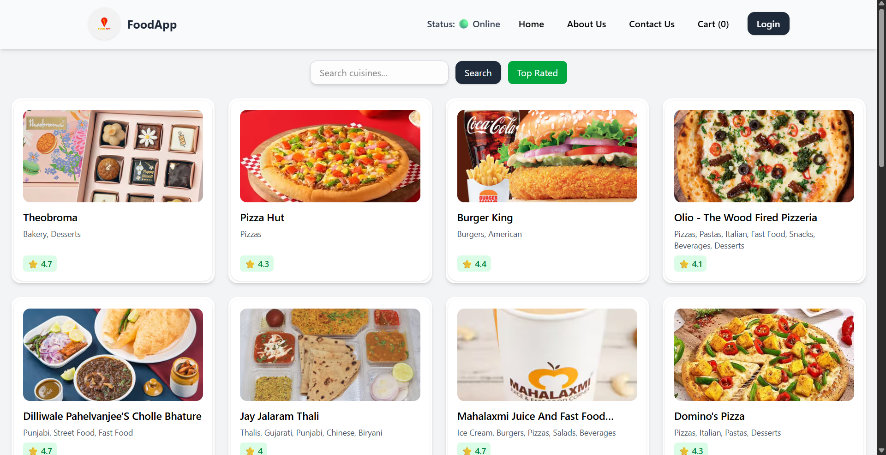
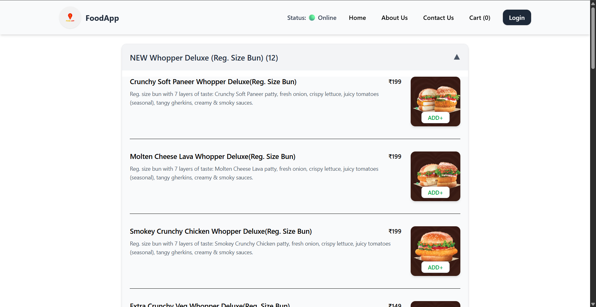
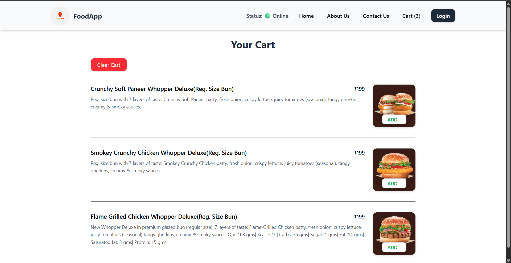

# 🍽️ Food Delivery App

A modern and visually appealing **React-based Food Delivery Web App** with restaurant listings, menus, cart system, online status detection, context API, Redux Toolkit, and smooth UI powered by Tailwind CSS.


---

## ⭐ Project Highlights

---


---

## ⭐ Project Highlights

### 🏠 **Home Page**

* Beautiful grid layout showcasing restaurants.
* Search bar with hover animations.
* "Top Rated" filter.
* Smooth card lift effects.

### 📋 **Restaurant Menu Page**

* Dynamic menu based on restaurant ID.
* Accordion-style categories.
* Add items directly to cart.

### 🛒 **Cart Page**

* View added items.
* Clear cart option.
* Global state handled with Redux Toolkit.

### 🌐 **Online Status**

* Detects real-time internet connection.
* Shows green/red indicator in header.

### 👤 **User Context**

* Logged-in username displayed everywhere using Context API.

### 📦 **Tech Used**

* **React 18**
* **React Router DOM**
* **Redux Toolkit**
* **Tailwind CSS**
* **Context API**
* **Custom Hooks**
* **Vercel Deployment**

---

## 🖼️ Screenshots

### 🏠 Home Page



### 📋 Menu Page



### 🛒 Cart Page



> All images are stored in the `screenshot/` folder.

---

## 📂 Folder Structure

```
project/
 ├── src/
 │    ├── components/
 │    │     ├── Header.jsx
 │    │     ├── Body.jsx
 │    │     ├── Cart.jsx
 │    │     ├── RestaurantMenu.jsx
 │    │     ├── ResCard.jsx
 │    │     └── Shimmer.jsx
 │    │
 │    ├── utils/
 │    │     ├── UserContext.js
 │    │     ├── appStore.js
 │    │     ├── cartSlice.js
 │    │     └── useOnlineStatus.js
 │    │
 │    ├── App.jsx
 │    └── main.jsx
 │
 ├── screenshot/
 │     ├── HomePage.png
 │     ├── MenuPage.png
 │     └── CartPage.png
 │
 └── README.md
```

---

## 🧠 Key Concepts Used

### 🔹 **Context API (UserContext)**

```jsx
<UserContext.Provider value={{ loggedInUser: "Shivam" }}>
   <App />
</UserContext.Provider>
```

### 🔹 **Redux Toolkit (Cart State)**

```js
dispatch(addItem(item));
```

### 🔹 **Custom Hook Example**

```js
const onlineStatus = useOnlineStatus();
```

---

## 🛠️ Installation

```bash
git clone https://github.com/heyshivamjaiswal/food-delivery-.git
cd food-delivery-
npm install
npm run dev
```

---

## 🌍 Live Demo

**Vercel Deployment:**
👉 [https://food-delivery-sigma-blond.vercel.app/](https://food-delivery-sigma-blond.vercel.app/)

---

## ❤️ Author

Made with passion by **Shivam (Stari)**.

---

## 📜 License

This project is open-source under the **MIT License**.

